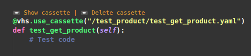
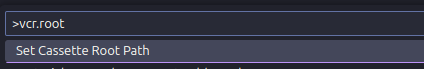
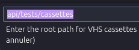

<div align="center">
					<a href='https://ko-fi.com/caradim' target='_blank'></a>
					&nbsp;&nbsp;&nbsp;&nbsp;&nbsp;
					<a href='https://www.linkedin.com/in/dimitri-caramello/' target='_blank'></a>
</div>

# VCR Manager

VS Code extension to manage VCR cassettes for Python tests using decorators like `@vcr.use_cassette`, `@vhs.use_cassette`, or `@pytest.mark.vcr`.



## Features

- Detects all common ways to define a cassette in Python tests.
- Shows "Show cassette" and "Delete cassette" buttons above each test.
- Supports explicit cassette paths and automatic path generation.
- Configurable root path for cassettes.
- Command palette integration to set the cassette root path.

## Example Project Structure

```plaintext
my-django-project/
├── manage.py
├── api/
│   └── tests/
│       ├── test_catalog_controller.py
│       └── cassettes/
│           └── test_catalog_controller/
│               └── test_get_product_offerings.yaml
```

## Example Test Code

```python
@vhs.use_cassette("/test_product/test_get_product.yaml")
def test_get_product(self):
	# Test code here

@pytest.mark.vcr()
def test_create_product(self):
	# Test code here
```

## Automatic Cassette Path Generation

If no path is provided in the decorator, the cassette path is automatically generated as:

```
cassettes/<test_file_name>/<test_function_name>.yaml
```

For example, for `test_create_product` in `test_product.py`, the cassette will be:

```
cassettes/test_product/test_create_product.yaml
```

## Configuration

You can set the root path for cassettes in the extension settings or via the command palette (`vcr.root`).





## Usage

1. Open a Python test file in VS Code.
2. The extension will show buttons above each test using a VCR decorator.
3. Use the buttons to show or delete the associated cassette file.

---

## Support

Need help? Have a feature request? Found a bug?
- [Write a review](https://marketplace.visualstudio.com/items?itemName=dcaramello.python-debug-test&ssr=false#review-details)


## Credits

Created by Dimitri Caramello